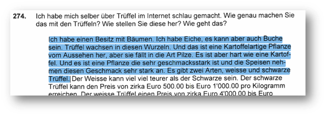
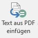
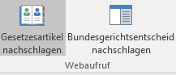
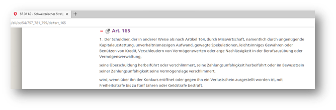
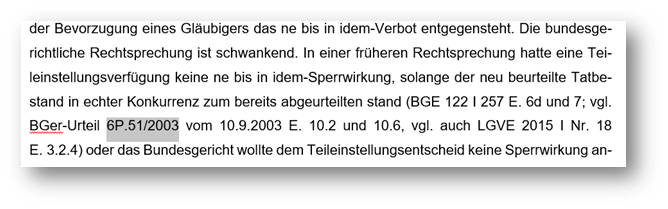
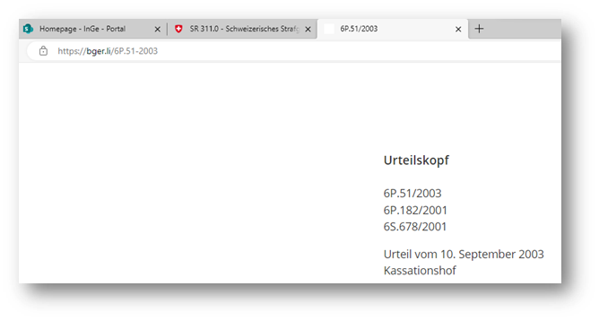

# "KRG (Kriminalgericht) Makros": Übersicht und Funktionsumfang

## Ausgangslage/Problemstellung

Mit der zunehmenden Digitalisierung liegen immer mehr Verfahrensdokumente digital vor oder können innert nützlicher Frist digitalisiert werden. Aktueller "state of the art" zur Wiedergabe elektronischer Verfahrensakten ist das PDF-Format. Wünschenswert wäre, wenn man mit dem Textinhalt eines PDF-Dokuments – etwa zur Erstellung eines Urteilsentwurfs – in einem Textverarbeitungsprogramm sofort weiterarbeiten könnte. Leider gestaltet sich die diesbezügliche Übertragung einer PDF-Textstelle in eine Word-Textstelle oft mühevoll, wie nachfolgendes Beispiel zeigt:

Wird die folgende Textstelle in einem PDF-Programm – etwa mit dem Tastenkürzel ctrl+C – kopiert und in einem Word Dokument (Tastenkombination: ctrl+V) eingefügt, könnte der eingefügte Text etwa so aussehen:

Dieser Text muss – soll er in ein akzeptables Format gebracht werden – weiterverarbeitet werden, es müssen alle Zeilenschaltungen händisch entfernt werden. Zudem müssen die Worttrennungen (Kartof-fel, neh-men) entfernt werden. Zuletzt muss das kleingeschriebene L beim Wort "lch" mit einem grossgeschriebenen I ausgetauscht werden. Dies bedeutet im Ergebnis, dass zur Einfügung dieses Textabschnitts mind. neun weitere Bearbeitungsschritte erforderlich sind.

## Hilfestellung durch KRG Makros

Um erforderlichen Arbeitsschritte der Einfügung eines aus einem PDF-Dokument kopierten Textabschnitts zu verringern, stellen die KRG Makros zwei Hilfestellungen zur Verfügung. Diese Hilfestellungen können in Word beispielsweise wie folgt als Buttons eingebunden werden.

## Makro "Text aus PDF einfügen" (PDFTextEinfuegen)

Das Makro "Text aus PDF einfügen" setzt – bei einem Klick auf den Button – einen zuvor im PDF-Dokument kopierten, nun in der sog. Zwischenablage befindlichen, Textabschnitt an der Stelle ein, wo der Cursor gesetzt ist. Dabei werden die zuvor beschriebenen Arbeitsschritte – Zeilenumschaltungen löschen, Worttrennungen löschen, fehlerhafte Erkennung des I als L im Wort "Ich" – automatisch ausgeführt. Über diese Arbeitsschritte muss man sich keine Gedanken mehr machen, sondern den Text nur noch auf Fehler überprüfen, die ansonsten bei Textkonversionen aus PDF-Dokumenten regelmässig entstehen können (in vorliegendem Beispiel wurde bspw. das S in "es" als grossgeschrieben erkannt).

## Makro "als Aussage von Mann/Frau einfügen" (AussageMannEinfuegen/AussageFrauEinfuegen)

Die Makros/Buttons "als Aussage von Mann einfügen"/"als Aussage von Frau einfügen" können verwendet werden, wenn es darum geht, die Angabe/Aussage einer Drittperson wiederzugeben (etwa die Wiedergabe von Aussagen anlässlich von Einvernahmen oder die Geltendmachung eines Rechtsstandpunkts einer Verfahrenspartei). Diese Makros führen – zusätzlich zu den oben beschriebenen Funktionen (PDFTextEinfuegen) – weitere Anpassungen an dem in der Zwischenablage befindlichen Text durch, bevor er eingefügt wird. 

-	Einerseits erfolgt die Umstellung von der ersten in die dritte Person, 
-	anderseits werden die Verben in die Konjunktivform umgestellt 

So wird bspw. der Satz "Ich bin unschuldig" in "Er sei unschuldig" konvertiert.

Dabei – wie das nachfolgend angeführte Beispiel zeigt – ist zu beachten, dass diese Anpassungen nur mit einer "hart codierten" Liste von vielfach verwendeten Verben vorgenommen werden. Der eingefügte Text bedarf in jedem Fall noch der Kontrolle und (meistens auch) Überarbeitung.

## weitere Funktionalitäten

nebst den zuvor angesprochenen Funktionen, für welche die KRG Makros ursprünglich entwickelt worden sind, sind im Laufe der Zeit weitere hinzugekommen:

Diese Makros dienen dem schnellen Nachschlagen von Gesetzesartikeln des Bundes und Bundesgerichtsentscheiden. Sie funktionieren so, dass man in einem Text eine entsprechende Gesetzesangabe (mitsamt der Abkürzung "Art. " und der Abkürzung des Erlasses) markiert 

und dann den entsprechenden Button bzw. das Makro aktiviert. Dann sollte sich der Browser bei der fraglichen Gesetzesbestimmung öffnen:

Dieselbe Funktionalität besteht für das schnelle Aufrufen von Bundesgerichtsentscheiden auf der Website bger.li, indem man die Fall-Nummer des Entscheids markiert und den entsprechenden Button drückt:

